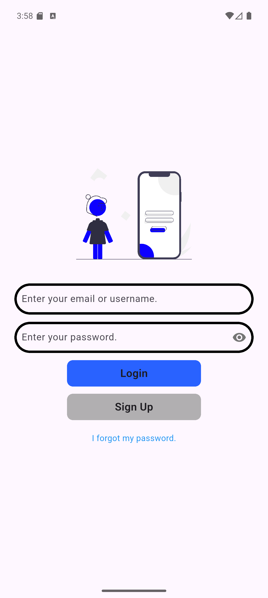

# TV App 🎬📺

[TV App](https://play.google.com/store/apps/details?id=com.onurerdem.tv_app), [**TVmaze API**](https://www.tvmaze.com/api) kullanarak TV dizilerini keşfetmenizi, favorilerinize eklemenizi, izlediğiniz bölümleri işaretlemenizi ve izleme listenizi yönetmenizi sağlayan modern bir Flutter uygulamasıdır.
Uygulama, **Clean Architecture**, [**BLoC**](https://bloclibrary.dev/), [**GetIt (Dependency Injection)**](https://pub.dev/packages/get_it) ve [**Firebase**](https://firebase.google.com/) altyapısıyla geliştirilmiştir.

📲 Google Play Store’dan indirin:
[](https://play.google.com/store/apps/details?id=com.onurerdem.tv_app)

---

## ✨ Özellikler

* 📌 **Dizi Keşfetme**: [TVmaze API](https://www.tvmaze.com/api) üzerinden popüler dizilere göz atın.
* ⭐ **Favoriler**: Sevdiğiniz dizileri favorilerinize ekleyin.
* ✅ **İzlenenler**: İzlediğiniz dizileri ve bölümleri işaretleyin.
* 📋 **İzleme Listesi**: Daha sonra izlemek istediklerinizi listenize ekleyin.
* 👤 **Profil Sayfası**: Firebase Authentication ile oturum açın, e-posta doğrulama yapın.
* 🔍 **Arama**: Favorileriniz arasında hızlıca arama yapın.
* 🌙 **Temiz Mimari**: Veri katmanı, domain katmanı ve sunum katmanı net bir şekilde ayrılmıştır.
* ☁️ **Firebase Entegrasyonu**: Authentication, Firestore ve kullanıcıya özel veriler.

---

## 🛠 Kullanılan Teknolojiler

* [Flutter](https://flutter.dev/) – Flutter, tek bir kod tabanından güzel, yerel olarak derlenmiş, çoklu platform uygulamaları oluşturmak için kullanılan açık kaynaklı bir çerçeve.
* [Dart](https://dart.dev/) – Herhangi bir platformda yüksek kaliteli uygulamalar için erişilebilir, taşınabilir ve üretken bir dil.
* [BLoC](https://bloclibrary.dev/) – (State Management) Dart için öngörülebilir bir durum yönetimi (state management) kütüphanesi.
* [GetIt](https://pub.dev/packages/get_it) – (Dependency Injection) [GetIt](https://pub.dev/packages/get_it), [Splat](https://github.com/reactiveui/splat)'tan büyük ölçüde esinlenerek geliştirilmiş bazı ek özelliklere sahip, Dart ve Flutter projeleri için basit bir Hizmet Bulucu'dur (Service Locator). InheritedWidget veya Provider yerine, örneğin kullanıcı arayüzünüzden nesnelere erişmek için kullanılabilir.
* [Dio](https://pub.dev/packages/dio) – (HTTP İstemcisi) Dart/Flutter için güçlü bir HTTP ağ paketi, global yapılandırma, önleyiciler, FormData, istek iptali, dosya yükleme/indirme, zaman aşımı, özel adaptörler, dönüştürücüler vb. özellikleri destekler.
* [Dartz](https://pub.dev/packages/dartz) – Dartz, Dart programlama dilinde, fonksiyonel programlama araçlarını sağlayan bir pakettir. Bu paket, Dart dilinde veri yapılarını, monad'ları, lens'leri ve diğer fonksiyonel programlama araçlarını kullanarak kodları daha temiz ve etkili hâle getirmeyi amaçlar.
* [Equatable](https://pub.dev/packages/equatable) – Equatable, Flutter'da nesnelerin değerlerine göre eşitlik kontrolü yapmak için kullanılan bir Dart paketidir. Bu paket, nesnelerin kimliklerine değil, içerdikleri özelliklere göre karşılaştırılmasını sağlar.
* [Shared Preferences](https://pub.dev/packages/shared_preferences) – Flutter'da shared_preferences, uygulamanızdaki küçük verileri anahtar-değer çiftleri şeklinde yerel olarak saklamak ve gerektiğinde bu verilere erişmek için kullanılan bir kütüphanedir.
* [flutter_svg](https://pub.dev/packages/flutter_svg) – flutter_svg, Flutter için bir SVG (Ölçeklenebilir Vektör Grafikleri) işleme ve widget kütüphanesidir.
* [flutter_dotenv](https://pub.dev/packages/flutter_dotenv) – flutter_dotenv, Flutter uygulamalarında bir .env dosyasından ortam değişkenlerini yüklemek için kullanılan bir pakettir. Bu paket, uygulamanızın farklı ortamlar (örneğin, geliştirme, üretim) için farklı yapılandırma değerlerini yönetmenizi sağlar. Ortam değişkenleri, anahtar-değer çiftlerinden oluşan ve uygulama içinde erişilebilen bilgilerdir, örneğin API anahtarları veya sunucu adresleri.
* [Cached Network Image](https://pub.dev/packages/cached_network_image) – Flutter'da cached_network_image, internetten resimleri yükleyip bunları önbelleğe alarak daha sonra tekrar kullanıldığında yeniden indirilmesini önleyen, uygulama performansını artıran bir pakettir.
* [url_launcher](https://pub.dev/packages/url_launcher) – url_launcher, Flutter'da bir URL'yi açmak için kullanılan bir kütüphanedir. Bu kütüphane, web sayfalarını, telefon aramalarını, SMS mesajları göndermeyi ve e-posta uygulamalarını açmayı destekler.
* [Firebase](https://firebase.google.com/) – (Auth & Firestore) Firebase, Google tarafından mobil ve web uygulamaları oluşturmak için geliştirilmiş bir bulut tabanlı platformdur.
* [TVmaze API](https://www.tvmaze.com/api) – (Dizi Verileri) [TVmaze](https://www.tvmaze.com/), dünya çapındaki TV meraklıları tarafından derlenen, programlar, bölümler, oyuncular, ekip ve karakterler hakkında ayrıntılı bilgi sağlayan, topluluk odaklı bir TV veritabanı ve kişisel TV rehberidir. Platform ayrıca, geliştiricilerin TV meta verilerini diğer uygulamalara ve web sitelerine entegre etmeleri için ücretsiz bir [API](https://www.tvmaze.com/api) sunmaktadır.
* [Lottie](https://lottiefiles.com/) – Lottie, Airbnb tarafından geliştirilen ve Adobe After Effects ile oluşturulan animasyonları JSON formatında dışa aktarmak için Bodymovin eklentisini kullanan, mobil ve web platformlarında çalışan bir animasyon kütüphanesidir. Flutter'da Lottie, bu JSON formatındaki animasyonları doğrudan uygulamalarınıza entegre etmenizi sağlar.
* [Font Awesome](https://fontawesome.com/) – Font Awesome, web sitelerinde kullanılan ikonları CSS olarak tasarlayan ve kullanıcıya kolaylıkla entegre etme imkanı sunan bir CSS kütüphanesidir.

---

## 🚀 Kurulum

### 1. Depoyu Klonla

```bash
git clone https://github.com/onurerdem/tv_app.git
cd tv_app
```

### 2. Bağımlılıkları Kur

```bash
flutter pub get
```

### 3. Firebase Kurulumu

* Firebase Console’da bir proje oluşturun.
* `google-services.json` dosyasını `android/app/` içine ekleyin.
* `GoogleService-Info.plist` dosyasını `ios/Runner/` içine ekleyin.
* FlutterFire CLI ile `firebase_options.dart` dosyasını oluşturun.

```bash
flutterfire configure
```

### 4. Çalıştır

```bash
flutter run
```

---

## 📱 Uygulama Önizlemeleri
<p align="center">

  
  
  
  
  
  
  
  
  
  
  
  
  
  </p>

  <p align="center">
</p>

---

## 📱 Uygulama Ekran Görüntüleri

Splash Ekranı | İlk Onboarding Ekranı | İkinci Onboarding Ekranı | Üçüncü Onboarding Ekranı | Giriş Ekranı | Kayıt Ekranı
:-------------------------:|:-------------------------:|:-------------------------:|:-------------------------:|:-------------------------:|:-------------------------:
 |  |  |  |  |  |

Şifremi Unuttum Ekranı | E-Posta Doğrulama Ekranı | Diziler Ekranı | Oyuncular Ekranı | Profil Ekranı | Profil Düzenleme Ekranı |
:-------------------------:|:-------------------------:|:-------------------------:|:-------------------------:|:-------------------------:|:-------------------------:
 |  |  |  |  |  |

Şifre Değiştirme Ekranı | Dizi Arama Ekranı | Dizi Detayları Ekranı Başı | Dizi Detayları Ekranı Sonu | Bölüm Detayları Ekranı | Oyuncu Detayları Ekranı |
:-------------------------:|:-------------------------:|:-------------------------:|:-------------------------:|:-------------------------:|:-------------------------:
 |  |  |  |  |  |

Favori Diziler Ekranı | İzlenecek Diziler Ekranı | İzlenilen Diziler Ekranı | Oyuncu Arama Ekranı | Favori Oyuncular Ekranı |
:-------------------------:|:-------------------------:|:-------------------------:|:-------------------------:|:-------------------------:
 |  |  |  |  |

---

## 📦 APK / Yayın

* Debug sürümü almak için:

```bash
flutter build apk --debug
```

* Play Store için release sürümü:

```bash
flutter build appbundle --release
```

---

## 🔑 Çevresel Değişkenler (.env)

`.env` dosyasında Firebase API anahtarları tutulur:

```env
FIREBASE_WEB_WINDOWS_API_KEY=xxx
FIREBASE_ANDROID_API_KEY=xxx
FIREBASE_IOS_MACOS_API_KEY=xxx
```

---

## 🤝 Katkıda Bulunma

1. Bu repoyu fork edin.
2. Yeni bir branch açın: `feature/yenilik`
3. Değişikliklerinizi commit edin.
4. Pull request gönderin.

---

## 📄 Lisans

Bu proje **MIT Lisansı** altında lisanslanmıştır. MIT Lisansı, yazılımın serbestçe kullanılmasına, değiştirilmesine ve dağıtılmasına izin verir; tek şart lisans metninin korunmasıdır. Yazılım "olduğu gibi" sunulur ve geliştirici sorumluluk kabul etmez. Daha fazla bilgi için [LICENSE](./LICENSE) dosyasına göz atın.

---

### 👨‍💻 Geliştirici

[Onur Erdem](https://play.google.com/store/apps/developer?id=Onur+Erdem)
📧 [E-posta ile iletişim](mailto:erdem.onur@outlook.com.tr)
🌐 [LinkedIn](https://www.linkedin.com/in/erdemonur/) | [GitHub](https://github.com/onurerdem)

---
